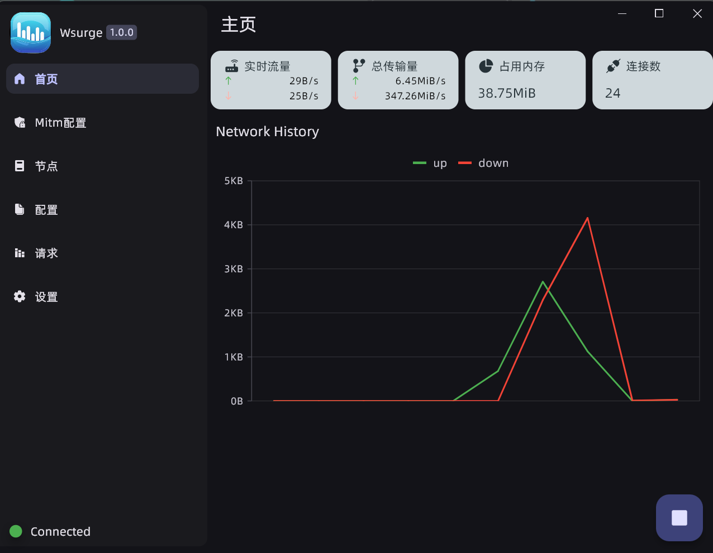
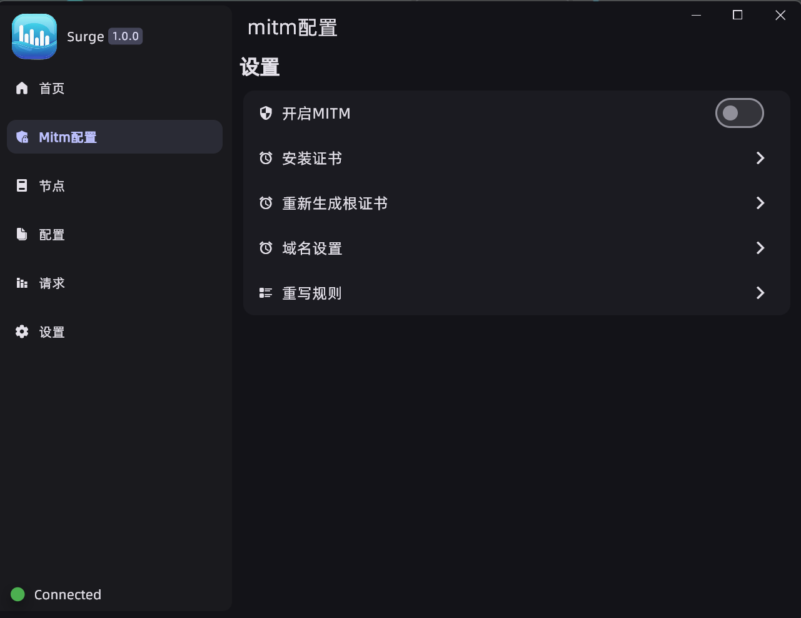
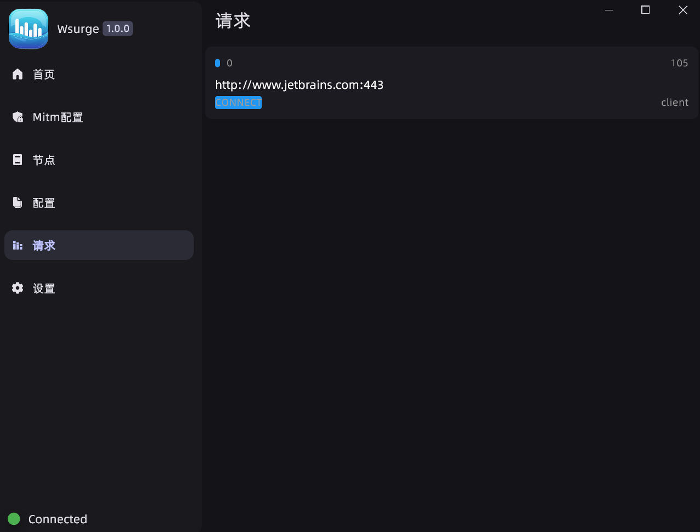
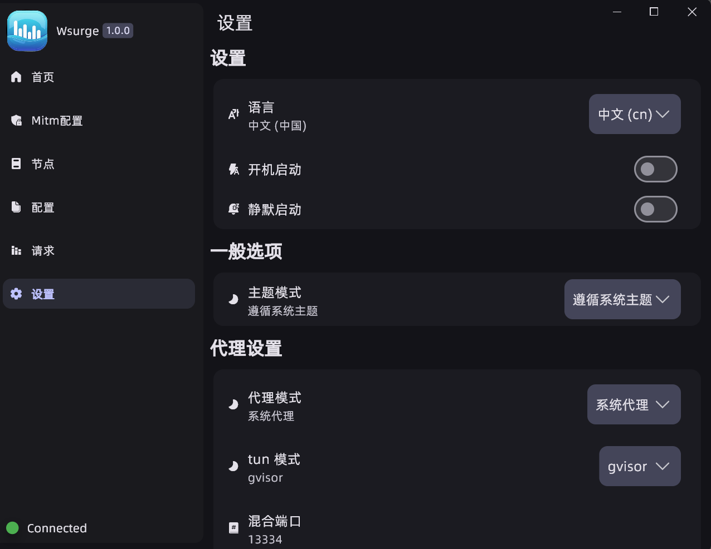

# wsurge

A windows proxy client based on Singbox, simple and easy to use, open-source and ad-free.
## Preview

  
  
  
  

## Features and Road map:
- [x] Convert clash config to SingBox
- [x] Convert clash rule to SingBox srs
- [x] Enable Mitm 
- [ ] ToDo: Support tun mode mitm
- [ ] ToDo: Add more scripts support
## ✏️ Acknowledgements

We would like to express our sincere appreciation to the contributors of the following projects, whose robust foundation and innovative features have significantly enhanced the success and functionality of this project.

- [Sing-box](https://github.com/SagerNet/sing-box)
- [hiddify-app](https://github.com/hiddify/hiddify-app)
- [gomitmproxy](https://github.com/AdguardTeam/gomitmproxy)
- [Others](./pubspec.yaml)
